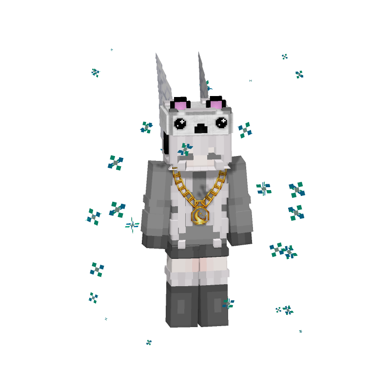
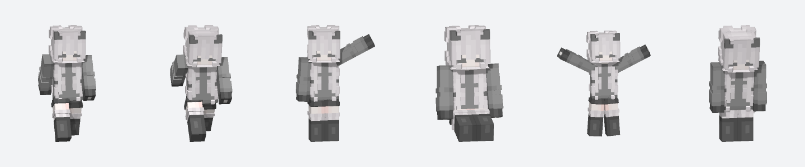
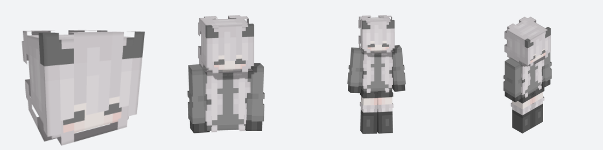
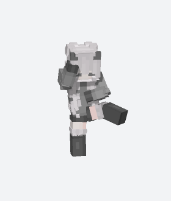
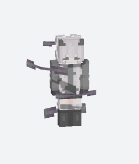

# SkinStudio

Server-side HTTP API that renders Minecraft Java skins as full-body PNGs,
GIFs, and APNGs — no browser, no GPU, no Minecraft server.



|  |  |
|---|---|
|  | **Poses** — walking, running, waving, sitting, cheering, crouching |
|  | **Render modes** — head, bust, fullbody, fullbodyiso |
|  | **Lunar emote** `l_dance`, native duration |
|  | **Lunar aura cosmetic** `Wind Aura`, animated |

## Features

- Full-body, bust, head, face, and isometric renders — by Minecraft name, UUID, texture hash, or uploaded PNG
- A dozen built-in poses, plus animated APNG/GIF for cyclic ones (walking, running, waving, marching)
- Lunar Client cosmetics by numeric ID — cloaks, wings, hats, auras, pets, companions
- Lunar Client emotes from their native keyframe data, including elbow/knee articulation and prop meshes
- Plain, mode-named routes (`/head`, `/bust`, `/fullbody`, ...) for drop-in compatibility

## Getting started

Requires Node.js 20+.

```bash
npm install
npm start
```

```html

```

## Rendering a player

```text
GET /v1/render/Notch.png?type=walking&size=512
GET /v1/render/Notch.png?pose=cheering&background=18181b
GET /v1/render/069a79f444e94726a5befca90e38aaf5?pose=crouching
GET /v1/render/GommeHD.png?pose=walking&size=1024&background=e7e9ed&shadow=true
GET /v1/render/GommeHD.gif?pose=running&cosmetic=9304&frames=16&fps=12
GET /v1/render/Oberaudorf.png?pose=showcase&width=399&height=465&background=000000
```

`type`/`pose` values: `showcase` `idle` `standing` `walking` `marching`
`running` `crouching` `cheering` `waving` `pointing` `sitting` — or
`GET /v1/poses` for the machine-readable list.

## Lunar cosmetics by ID

```text
GET /v1/render/ignLuna.png?cosmetic=731&width=399&height=465
GET /fullbody/ignLuna?cosmetics=1,731&size=512
GET /fullbodyiso/ignLuna?cosmetic=9514&cosmetic=9499&size=1024
GET /v1/render/ignLuna.gif?pose=waving&cosmetics=3436,1,2640,9500&download=true

GET /v1/cosmetics?available=true&limit=100
GET /v1/cosmetics?category=hat&q=crown
GET /v1/cosmetics/731
```

- `cosmetic`/`cosmetics` repeat or comma-separate, up to 16 per image
- Full-body routes only (`/v1/render`, `/fullbody`, `/fullbodyback`, `/frontfull`, `/fullbodyiso`) — not face/head/bust/skin
- Reads IDs/metadata from `.lunarclient/textures/assets/lunar/cosmetics.json`; missing models/textures are JIT-fetched from Lunar and SHA-1 verified on first use (`LUNAR_COSMETIC_DOWNLOADS=false` to disable, `LUNAR_CLIENT_DIR` to point at a Lunar install elsewhere)
- Classic cloaks/wings, OBJ cosmetics, and Gecko/Bedrock models (incl. slim) all supported; animated cosmetic textures sample one representative frame in static PNGs
- Cosmetic geometry respects depth against the extruded 3D second skin layer, so cloaks/wings don't show through the body

**Auras, pets, and other geckolib cosmetics** run on continuous Molang
formulas (spins, falls, fades) rather than fixed keyframes. Animated
GIF/APNG output re-samples the cosmetic every frame so that motion actually
plays out, ping-pongs back to its start so the clip loops seamlessly, and
paces itself to the real playback duration so short clips don't look sped
up. Two rigs with no built-in spread (Money Aura, Autumn Leaf Aura) get a
synthetic ring-scatter and fall layered on top instead of spinning in place.

## Lunar emotes as GIF

```text
GET /v1/render/ignLuna.gif?emote=10&width=399&height=465
GET /v1/render/ignLuna.gif?emote=l_dance&cosmetics=731,9304&download=true
GET /v1/render/ignLuna.png?emote=10&frame=0.5
GET /v1/render/ignLuna.gif?emote=dab&size=512

GET /v1/emotes?q=dance
GET /v1/emotes?looping=true&limit=100
GET /v1/emotes/10
```

- Rendered from Lunar's own `emotes.json` and `actions*.bobj` keyframes, by ID or internal name; `download=true` forces a GIF download, `frame=0..1` renders one instant as a PNG
- Elbows/knees get their own articulated bone segments during an emote (regular poses keep straight limbs)
- Without `frames`/`fps`, Lunar's native duration is used (20 ticks/s) — `l_dance` is exactly 0.8s
- Prop meshes (e.g. emote `67`, catalog ID `475`) load from `props*.bobj` + WebP textures and fade on schedule via scale keyframes

<details>
<summary><strong>Full emote catalog</strong> — 177 of 182 verified end-to-end (<code>npm run audit:emotes</code>), correct limb connectivity and native-duration playback speed</summary>

| ID | Name | Duration | Loop |
|---:|---|---:|:---:|
| `7` | `fresh` | 5.05 s | yes |
| `8` | `hype` | 3.4 s | yes |
| `9` | `squat_kick` | 11.6 s | yes |
| `10` | `l_dance` | 0.8 s | yes |
| `11` | `tidy` | 5.2 s | yes |
| `12` | `free_flow` | 7.9 s | yes |
| `13` | `shimmer` | 7.8 s | yes |
| `14` | `get_funky` | 8.6 s | yes |
| `15` | `gun_lean` | 7.2 s | yes |
| `16` | `gangnam_style` | 0.9 s | yes |
| `17` | `salute` | 2.5 s | no |
| `18` | `bitchslap` | 3.35 s | no |
| `19` | `bongo_cat` | 7.9 s | no |
| `20` | `breathtaking` | 5.1 s | no |
| `21` | `disgusted` | 6.65 s | no |
| `22` | `exhausted` | 11 s | yes |
| `23` | `punch` | 1.9 s | no |
| `24` | `sneeze` | 6.65 s | no |
| `25` | `threatening` | 2.3 s | no |
| `26` | `woah` | 2.2 s | no |
| `27` | `boneless` | 2 s | yes |
| `28` | `best_mates` | 0.55 s | yes |
| `29` | `default` | 6.95 s | yes |
| `30` | `disco_fever` | 8.75 s | yes |
| `31` | `electro_shuffle` | 8.45 s | yes |
| `32` | `floss` | 1.6 s | yes |
| `33` | `infinite_dab` | 0.95 s | yes |
| `34` | `orange_justice` | 6.5 s | yes |
| `35` | `skibidi` | 0.8 s | yes |
| `36` | `boy` | 1.45 s | no |
| `37` | `bow` | 2.15 s | no |
| `38` | `calculated` | 1.65 s | no |
| `39` | `chicken` | 0.95 s | yes |
| `40` | `clapping` | 0.75 s | yes |
| `41` | `club` | 1 s | yes |
| `42` | `confused` | 7 s | no |
| `43` | `crying` | 1.35 s | yes |
| `44` | `dab` | 1.15 s | no |
| `45` | `facepalm` | 5.2 s | no |
| `46` | `fist` | 2.65 s | no |
| `47` | `laughing` | 0.75 s | yes |
| `48` | `no` | 1.9 s | no |
| `49` | `pointing` | 1.65 s | no |
| `51` | `pure_salt` | 5.2 s | no |
| `52` | `shrug` | 2.5 s | no |
| `53` | `t_pose` | 4 s | yes |
| `54` | `thinking` | 5 s | yes |
| `55` | `twerk` | 0.7 s | yes |
| `56` | `wave` | 2 s | no |
| `57` | `yes` | 1.15 s | no |
| `58` | `naruto_run` | 1.5 s | yes |
| `63` | `whip_and_nae_nae` | 7 s | no |
| `64` | `hands_up` | 3.25 s | no |
| `65` | `renegade` | 13.3 s | no |
| `66` | `toosie_slide` | 5.85 s | yes |
| `67` | `fright_funk` | 7.5 s | yes |
| `68` | `make_it_rain` | 4.4 s | no |
| `69` | `rollie` | 13.25 s | yes |
| `70` | `savage` | 11.4 s | yes |
| `71` | `say_so` | 8.6 s | yes |
| `72` | `superhero_landing` | 3.45 s | no |
| `73` | `hug` | 5.9 s | no |
| `74` | `avatar_air` | 3.65 s | no |
| `75` | `avatar_earth` | 2.9 s | no |
| `76` | `avatar_fire` | 4.15 s | no |
| `77` | `avatar_water` | 3.45 s | no |
| `78` | `breakdance` | 8.25 s | no |
| `79` | `flippin_sexy` | 3.55 s | no |
| `80` | `proposal` | 10 s | no |
| `81` | `front_flip` | 2.5 s | no |
| `82` | `back_flip` | 2.5 s | no |
| `83` | `mall_dance` | 5.45 s | yes |
| `84` | `build_up` | 21.15 s | no |
| `85` | `dont_start_now` | 15.6 s | no |
| `86` | `outwest` | 6.85 s | yes |
| `88` | `rock_paper_scissors` | 3 s | no |
| `89` | `bubbles` | 10 s | no |
| `90` | `cold` | 9.1 s | no |
| `91` | `fireworks` | 9.8 s | no |
| `92` | `rainbow` | 4.65 s | no |
| `93` | `sparkles` | 2.5 s | no |
| `94` | `spit` | 3 s | no |
| `95` | `get_griddy` | 18.2 s | yes |
| `96` | `around` | 8.5 s | yes |
| `97` | `bop` | 15.05 s | yes |
| `98` | `drop_it` | 22.25 s | yes |
| `99` | `jiggle` | 59.75 s | yes |
| `100` | `rick` | 29.1 s | yes |
| `134` | `chicken_wing` | 31.5 s | yes |
| `135` | `blinding` | 41.2 s | yes |
| `136` | `head_spin` | 9.25 s | yes |
| `137` | `party_animal` | 22.7 s | yes |
| `138` | `pon` | 22.4 s | yes |
| `139` | `rockstar` | 32 s | yes |
| `167` | `brewing` | 10 s | no |
| `168` | `candies` | 5.35 s | no |
| `169` | `candy_puke` | 9.65 s | no |
| `170` | `ghostbusters` | 8.5 s | yes |
| `171` | `ghosts_in_the_keys` | 23.65 s | yes |
| `172` | `i_will_survive` | 35 s | no |
| `173` | `monster_mash` | 40.5 s | yes |
| `174` | `pandoras_box` | 12 s | no |
| `175` | `trick_or_treat` | 6.1 s | no |
| `176` | `vampire` | 10.5 s | no |
| `177` | `witch_flight` | 12.1 s | no |
| `178` | `zombie_walk` | 1.35 s | yes |
| `180` | `cup_of_joe` | 6.65 s | no |
| `183` | `jingle_bell` | 4.4 s | no |
| `184` | `present` | 7.75 s | no |
| `185` | `reindeer` | 6.55 s | no |
| `186` | `sled` | 9.8 s | no |
| `187` | `snow_buddy` | 21.55 s | no |
| `189` | `bench_press` | 12.15 s | no |
| `190` | `bicep_curls` | 12 s | no |
| `191` | `jumping_jacks` | 0.9 s | yes |
| `192` | `pull_ups` | 8.15 s | no |
| `193` | `push_ups` | 7.5 s | no |
| `194` | `spinning_boat` | 8.9 s | no |
| `200` | `cobra_kick` | 5 s | no |
| `201` | `pwr` | 2.5 s | no |
| `202` | `trinity_kick` | 5 s | no |
| `233` | `billy_bounce` | 11.2 s | yes |
| `234` | `blow_kiss` | 2.5 s | no |
| `235` | `charge_up` | 7.5 s | no |
| `236` | `high_five` | 2.4 s | no |
| `237` | `macarena` | 9.3 s | no |
| `238` | `moonwalk` | 1 s | yes |
| `239` | `old_school` | 3.85 s | yes |
| `240` | `pumpernickel` | 3.35 s | yes |
| `241` | `siuuu` | 1.55 s | no |
| `242` | `the_robot` | 9.8 s | yes |
| `266` | `breathing` | 4 s | no |
| `267` | `karate_chop` | 3.65 s | no |
| `268` | `zen` | 11.2 s | no |
| `269` | `possessed` | 6 s | no |
| `270` | `pumpkin_head` | 8 s | no |
| `271` | `skeleton_shake` | 0.85 s | yes |
| `272` | `spooky_scary_skeletons` | 1.8 s | yes |
| `273` | `wand` | 4.65 s | no |
| `274` | `wednesday` | 7.3 s | yes |
| `275` | `zombie_walk_v2` | 3 s | yes |
| `276` | `tip_hat` | 4 s | no |
| `277` | `lucky_day` | 8.15 s | no |
| `309` | `ambitious` | 9.3 s | yes |
| `310` | `back_on_74` | 6.55 s | yes |
| `311` | `cupids_arrow` | 13.2 s | yes |
| `312` | `dancin_domino` | 6.3 s | yes |
| `313` | `last_forever` | 11.6 s | yes |
| `314` | `make_waves` | 14.9 s | yes |
| `315` | `pollo` | 4.95 s | yes |
| `316` | `rebellious` | 9.6 s | yes |
| `317` | `shimmy_wiggle` | 1.75 s | yes |
| `318` | `side_shuffle` | 0.9 s | yes |
| `319` | `squabble` | 2.3 s | yes |
| `320` | `walkin_pretty` | 5.3 s | yes |
| `321` | `evil_plan` | 5.85 s | yes |
| `322` | `surfin_bird` | 7.2 s | yes |
| `342` | `coin_flip` | 5.5 s | no |
| `375` | `instruments_drums` | 4.4 s | yes |
| `376` | `instruments_guitar` | 6 s | yes |
| `377` | `instruments_keys` | 5.5 s | yes |
| `378` | `instruments_sax` | 7.35 s | yes |
| `379` | `instruments_trombone` | 6.15 s | no |
| `380` | `sturdy` | 7.6 s | yes |
| `408` | `feelin_alive_1` | 24.95 s | no |
| `409` | `feelin_alive_2` | 15 s | no |
| `410` | `lava_chicken` | 18 s | no |
| `441` | `jakura` | 5 s | no |
| `442` | `aura_farmer` | 10.4 s | yes |
| `475` | `67` | 2.3 s | no |
| `508` | `vibing` | 8 s | yes |
| `541` | `scuba` | 2.3 s | yes |
| `574` | `high_cortisol` | 3.3 s | yes |
| `575` | `low_cortisol` | 2.3 s | yes |
| `607` | `fancy_footwork` | 4.05 s | no |
| `608` | `kicks_up` | 9.9 s | no |
| `640` | `where_she_at` | 4 s | yes |

Five emotes (`popcorn`, `christmas_box`, `ice_skating`, `iceberg`,
`snowball_fight`) fail locally: their catalog entry points at a vanilla
Minecraft texture (`minecraft:...`) or has no mesh entry, neither of which
the API can resolve without a JIT download path for that namespace.

</details>

## Additional render routes

```text
GET /fullbody/{name|uuid|textureHash}
GET /bust/{name|uuid|textureHash}
GET /frontfull/{name|uuid|textureHash}
GET /fullbodyiso/{name|uuid|textureHash}
GET /fullbodyback/{name|uuid|textureHash}
GET /head/{name|uuid|textureHash}
GET /face/{name|uuid|textureHash}
GET /headiso/{name|uuid|textureHash}
GET /skin/{name|uuid|textureHash}
```

- Also reachable under `/v1/...`, optional `.png` extension; identifier is a name, UUID, or 64-char texture hash
- Value-less switches: `alex`, `steve` (wins if both given), `noshading`, `nolayers`
- `skin?process` upgrades legacy 64x32 skins to 64x64 and makes the base layer opaque
- Same modes for custom PNGs via `POST /head`, `POST /face`, `POST /bust`, etc.

```text
GET /head/Notch?steve&noshading
GET /fullbodyiso/Notch?nolayers&size=512
GET /skin/Notch?process
```

## Uploading your own skin

```bash
curl -X POST \
  -H "Content-Type: image/png" \
  --data-binary "@my-skin.png" \
  "http://localhost:3000/v1/render?pose=cheering&size=512" \
  --output render.png
```

- No JSON, no multipart — the request body is the PNG file
- `slim=true` for slim/Alex arms; player names auto-detect from the Mojang profile
- Handles regular 64x64 skins and HD skins (128x128, 256x256, 512x512)
- Default view: near-frontal orthographic `showcase`, portrait orientation — true isometric via `projection=isometric`
- The second skin layer (hat/hair, jacket, sleeves, pants) renders as extruded, pixel-accurate 3D geometry with real depth, light, and shadow
- `animated=true` → APNG; `format=gif`/`gif=true`/`.gif` → GIF. `waving`/`walking`/`running`/`marching` loop a closed motion cycle; cloaks sway, wings flap, pets/auras drift — disable with `animateCosmetics=false`

## Parameters

| Parameter | Default | Meaning |
|---|---:|---|
| `pose` / `type` | `showcase` | Name of the pose |
| `emote` | - | Lunar emote ID or internal name; replaces the normal pose (full body only) |
| `cosmetic` / `cosmetics` | - | One or more Lunar cosmetic IDs (full body only) |
| `view` | `front` | `front` or `back` for `/v1/render` |
| `size` | `1024` | Uniform PNG size; when given, the image is square |
| `width` | `880` | Separate image width from 64 to 2048 pixels |
| `height` | `1024` | Separate image height from 64 to 2048 pixels |
| `frame` | per pose | Phase of a cyclic motion, 0 to 1 |
| `slim` | automatic | `true`, `false`, or `auto` |
| `overlay` | `true` | Render the hat, jacket, sleeve, and pants layer |
| `layers` | `voxel` | `voxel` for extruded 3D pixels, `flat`, or `none` |
| `layerDepth` | `1` | Thickness of the second 3D layer, 0.25 to 2 |
| `animated` / `animate` | `false` | Produce an animated APNG instead of a static PNG |
| `format` | `png` | Output as `png`, `apng`, or `gif`; `gif` enables animation |
| `gif` | `false` | Shorthand for `format=gif` |
| `animateCosmetics` | matches output | Motion for cloaks, wings, pets, companions, and auras |
| `download` / `attachment` | `false` | Forces a browser download with a matching `.gif`/`.png` filename |
| `frames` | `12` | Number of animation frames, 2 to 120; Lunar emotes default to their native duration |
| `fps` | `12` | Frame rate, 1 to 30 FPS |
| `background` | `transparent` | `transparent`, `RRGGBB`, or `RRGGBBAA` |
| `yaw` | `-10` | Camera rotation for non-isometric projections |
| `pitch` | `12` | Camera height for non-isometric projections |
| `padding` | `0.1` | Margin as a fraction of the image, 0 to 0.3 |
| `antialias` | `2` | Edge smoothing: 1 or 2 |
| `shading` | `true` | Enable directional light; `noshading` also disables it |
| `shadow` | `true` | Enable self-shadowing and contact shadows |
| `dropShadow` | `false` | Enable a soft background/ground drop shadow |
| `projection` | `orthographic` | `isometric`, `perspective`, or `orthographic` |
| `cameraDistance` | `72` | Perspective strength/camera distance, 48 to 160 |

`frame` produces walk phases, e.g. `walking&frame=0.25` and `walking&frame=0.75`.

## Docker

```bash
docker build -t skinstudio .
docker run --rm -p 3000:3000 skinstudio
```

## Tests

```bash
npm test                              # unit + integration tests
npm run render:oberaudorf             # static reference renders → examples/
npm run audit:cosmetics ignLuna auras # contact sheet for one cosmetic category
npm run audit:emotes                  # contact sheet for the full emote catalog
```
